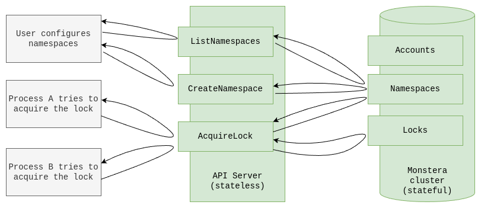

# Distributed Locks

[](https://goreportcard.com/report/github.com/evrblk/monstera-example/ledger/dlocks)

A distributed system for read/write locks. A lock can be exclusively locked for writing by a single process, or it can 
be locked for reading by multiple processes. If it is currently locked for writing, it cannot be locked for reading, and
vise versa. It can be used as a mutex if it is locked only for writing by all participating processes.

All locks are organized into Namespaces. Locks are referenced by name. Names are unique within a namespace. For example,
an ID of a resource that you want to control with locking can be used as a lock name.

Locks do not need to be created upfront. Basically, internally only currently acquired locks are stored. `AcquireLock` 
will grab a lock if it does not currently exist internally. `GetLock` will return an unlocked lock if it does not 
currently exist internally.

`AcquireLock` always returns the current lock state and `success: true` if a lock has been successfully locked by 
that request. `AcquireLock` does not throw errors if a lock cannot be locked (indicated by `success: false`) and the 
current lock state can be used to determine which process holds that lock.

All locks have a set expiration time (provided with `AcquireLock` request). If a lock is not extended or explicitly
released by that moment, it will become unlocked automatically. There are no hanging locks even when a process crashes.

A lock can be safely grabbed by the same process multiple times. Repeated `AcquireLock` calls extend lock’s expiration
time (if a different `expires_at` is provided) for long-running processes.

`ReleaseLock` unlocks a lock if a given process was holding that lock for writing, or removes that process from the list
of lock holders if it is locked for reading. If the process ID from `ReleaseLock` request does not hold that lock there
will be no errors, but nothing will be changed as the result. `DeleteLock` simply deletes a lock in any state. It can be
used to forcefully unlock any lock.



## Application cores

There are three application cores:

* `AccountsCore` in `accounts.go`. Not sharded.
  * `ListAccounts`
  * `GetAccount`
  * `CreateAccount`
  * `UpdateAccount`
  * `DeleteAccount`
* `NamespacesCore` in `namespaces.go`. Sharded by Account ID.
  * `GetNamespace`
  * `ListNamespaces`
  * `CreateNamespace`
  * `UpdateNamespace`
  * `DeleteNamespace`
* `LocksCore` in `locks.go`. Sharded by Account ID + Namespace Name.
  * `AcquireLock`
  * `ReleaseLock`
  * `DeleteLock`
  * `GetLock`

Take a look at tests (`locks_test.go`, `accounts_test.go`, and `namespaces_test.go`). 

## Cluster config

Pregenerated cluster config `cluster_config.json` has:

* 3 nodes
* 16 shards of `Namespaces`
* 16 shards of `Locks`
* 1 shard of `Accounts`
* 3 replicas of each

## How to run

1. Clone this repository.

```
git clone git@github.com:evrblk/monstera-example.git

cd ./monstera-example/dlocks
```

2. Make sure it builds:

```
go build -v ./...
```

3. Start a cluster with 3 nodes and a gateway server:

```
go tool github.com/mattn/goreman start
```

4. Create 100 accounts:

```
go run ./cmd/dev seed-accounts
```

5. Pick any account id from the previous step output.

6. Run test scenario 1 which creates a namespace and tries to grab a lock with the account id:

```
go run ./cmd/dev scenario-1 --account-id=9fff3bf7d1f9561d
```

## How to explore

For example, you want to understand how `AcquireLock` method works:

* Start reading from `server.go` in `LocksServiceApiServer.AcquireLock()`.
* Trace it down to `monstera.MonsteraClient` calls.
* Optional: You can jump further if you want to read Monstera sources.
* Find `LocksCoreAdapter.Update()` and find `AcquireLock` there.
* Trace it down to `LocksCore.AcquireLock()`.
* Understand how simple the code is and how it takes advantage of sequential application of updates.
